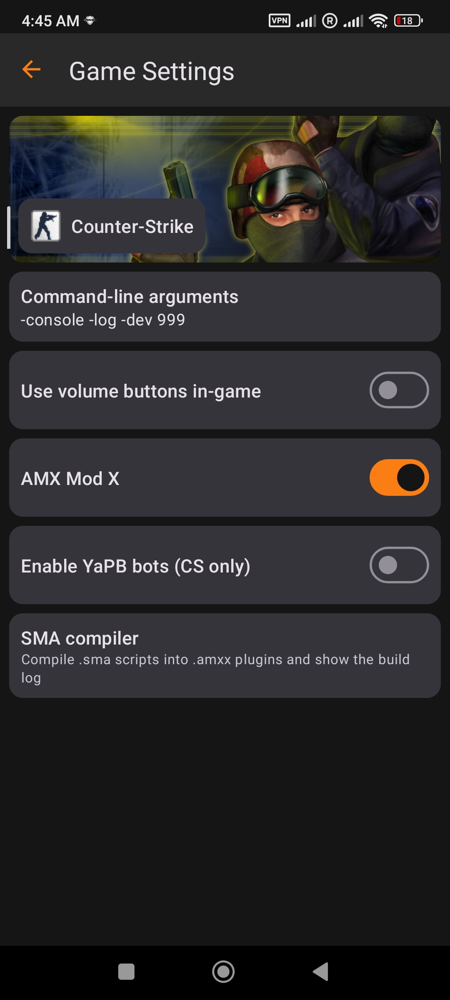
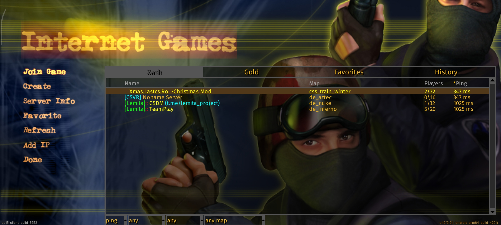
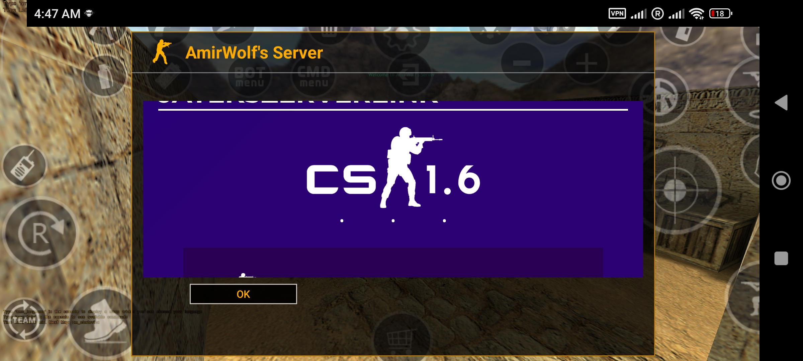
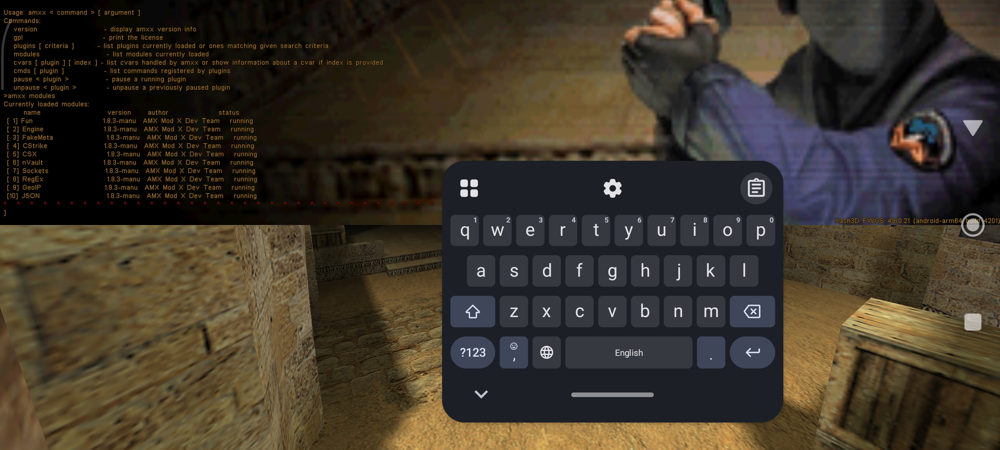
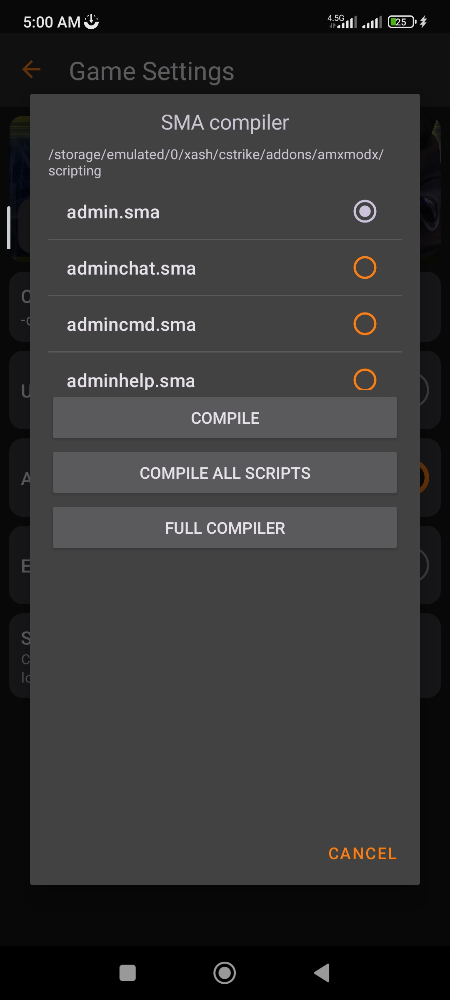

# CS16Client + AMX Mod X for Android

Run full **AMX Mod X 1.8.3 + Metamod-P** on **Counter-Strike 1.6 (cs16client)** with the **Xash3D FWGS** engine - no root, no Termux. This repo is the complete project: patched engine + patched game + AMXX/Metamod sources + build glue + GitHub Actions CI (auto-build + arm64 emulator test).

## Build

Prerequisites: JDK 17, Android SDK, **NDK r29 (29.0.14206865)**, ninja, zip.

```bash
# 1) get the source
git clone https://github.com/amirwolf5122/cs16-amxx-android
cd cs16-amxx-android

# 2) SDK / NDK paths
export ANDROID_HOME=/path/to/android-sdk
export ANDROID_NDK_HOME=$ANDROID_HOME/ndk/29.0.14206865
echo "sdk.dir=$ANDROID_HOME" > xash3d-fwgs-master/android/local.properties
echo "sdk.dir=$ANDROID_HOME" > cs16-client-main/android/local.properties

# 3) native part: AMXX core + modules, metamod, SMA compiler, addons zips
bash scripts/build_native.sh

# 4) engine APK
cd xash3d-fwgs-master/android && ./gradlew :app:assembleContinuous && cd ../..

# 5) game APK
cd cs16-client-main/android && ./gradlew :app:assembleGitRelease && cd ../..
```

Outputs:
- engine: `xash3d-fwgs-master/android/app/build/outputs/apk/.../app-continuous.apk`
- game: `cs16-client-main/android/app/build/outputs/apk/git/release/*.apk`
- addons: `out/cstrike-addons.zip` + `out/valve-addons.zip`

Individual steps:

```bash
bash glue/build_amxx.sh         # AMXX core + modules (libmm_amxmodx + libamxx_*)
bash glue/build_metamod.sh      # libmetamod_android_<abi>.so
bash glue/build_amxxpc.sh       # libamxxpc.so (in-app .sma compiler)
bash glue/make_addons_zips.sh   # out/cstrike-addons.zip + out/valve-addons.zip
```

Signing: engine uses its auto debug keystore; game uses `cs16-client-main/android/cs16client.keystore` (store pass `xash3damxx`, alias `cs16client`).

CI: every push to `main` runs **Build APKs** (both APKs + addons zips + a Release) and then **Test arm64** (boots an arm64 emulator, installs both APKs, runs the engine with metamod → amxmodx on generated minimal test content and checks that every module/plugin loads without a crash). Telegram report secrets `TG_BOT_TOKEN` / `TG_CHAT_ID` are optional.

## How the chain works

```
Xash3D FWGS (AMXX patch in engine/common/lib_common.c)
  └─ loads metamod from addons/metamod/dlls instead of libserver
      └─ metamod (libmetamod_android_<abi>.so)
          ├─ AMX Mod X core: libmm_amxmodx.so
          │   ├─ modules: libamxx_*.so
          │   └─ plugins: addons/amxmodx/plugins/*.amxx
```

Pawn cells are 32-bit while arm64 pointers are 64-bit - handled by pointer side-table patches in `amx.cpp`.

Modules (arm64 + armv7a): amxmodx, engine, fun, fakemeta, cstrike, csx, nvault, sockets, regex, geoip, sqlite, json, hamsandwich, cs_ham_bots_api.

## What changed / added (summary)

- **AMX Mod X 1.8.3 + Metamod-P added** - full plugin chain running on-device, no root (arm64 + armv7).
- **SMA → AMXX compiler added** - compile plugins right on the phone; real OK / FAILED result, broken stub outputs are caught and deleted.
- **MOTD** - real HTML window (server name as the title, images/links work, OK button); the team menu waits until you close it.
- **VoiceRecord** - voice privacy: the microphone opens only while `+voicerecord` is held (no permanent "sending voice" indicator).
- **Server list** - `Xash | Gold | Favorites | History` tabs; live GoldSrc master servers, hundreds of CS 1.6 servers.
- **Mods OK** - Zombie Plague 4.3/5.0, BaseBuilder, biohazard, Deathrun, ReGG, ReDeathmatch… compile & load; 14 AMXX modules bundled (ham, fakemeta, cstrike, csx, …).

## Screenshots

**Game Settings** - AMX Mod X toggle, YaPB bots, SMA compiler



**Server list** - `Xash | Gold | Favorites | History` tabs, live CS 1.6 servers



**MOTD** - real HTML window, server name as the title, OK button



**AMXX console** - 10 modules loaded and running on-device



**SMA → AMXX compiler** - pick `.sma` scripts and compile on the phone



---
Licenses follow the upstream projects (GPL).
